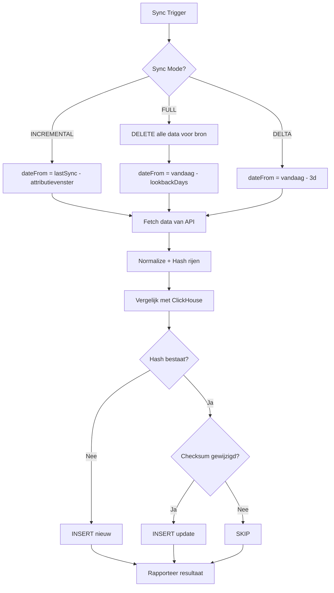

# Data Sync Strategie

## Probleem

De huidige sync haalt altijd ALLE data op (volledig lookback window) en slaat alles opnieuw op, ongeacht of er wijzigingen zijn. Dit is:
- **Onnodig zwaar** — 8630 rijen ophalen terwijl er misschien 50 nieuw zijn
- **Geen verschil** tussen eerste sync en update
- **Geen zichtbaarheid** in wat er nieuw/gewijzigd is

---

## Kernprincipe: Uniek ID (canonical_hash)

Elke rij in ClickHouse heeft een `canonical_hash` — een SHA-256 hash gebaseerd op **identiteitsdimensies**:

```
hash = SHA256(data_source_id + date + level + campaign_id + ad_group_id + ...)
```

> **Identiteitsdimensies** (wie/wanneer): `campaign_id`, `date`, `ad_group_id`, `keyword_text`, etc.
> **Attribuutdimensies** (wat/hoe): `campaign_status`, `bidding_strategy_type`, `campaign_labels` — deze kunnen veranderen zonder dat het een "nieuwe" rij is.

Vergelijk met e-commerce: `order_id` = identiteit, `order_status` = attribuut dat verandert.

---

## 3 Sync Modi

### 1. 📥 Incremental Sync (standaard, automatisch)

**Wanneer:** Dagelijkse/uurlijkse automatische sync, of handmatig "Data bijwerken"

**Hoe het werkt:**
1. Kijk naar `lastSyncedAt` van de databron
2. Haal alleen data op vanaf `lastSyncedAt - attributievenster` tot nu
3. Gebruik `canonical_hash` om te vergelijken:
   - **Nieuw hash** → INSERT (nieuwe data)
   - **Bestaand hash** → UPDATE via ReplacingMergeTree (attribuutwijzigingen)
   - **Hash bestaat in CH maar niet in nieuwe data** → markeer als stale (optioneel verwijderen)

**Attributievenster:** Google Ads conversies kunnen tot 30 dagen na klik binnenkomen. Daarom altijd de laatste N dagen opnieuw ophalen:

| Platform | Attributievenster | Standaard |
|----------|------------------|-----------|
| Google Ads | 7 dagen | Herlaad afgelopen 7 dagen |
| Meta Ads | 7 dagen | Herlaad afgelopen 7 dagen |
| GA4 | 1 dag | Alleen gisteren + vandaag |
| LinkedIn Ads | 3 dagen | Herlaad afgelopen 3 dagen |

**Resultaat:** In plaats van 8630 rijen, haal je bijv. 200 nieuwe + 400 updates op.

---

### 2. 🔄 Full Resync (handmatig)

**Wanneer:** Gebruiker klikt "Data herconfigureren" op de sync- of bronpagina

**Hoe het werkt:**
1. Verwijder ALLE data voor deze databron uit ClickHouse:
   ```sql
   ALTER TABLE metrics_data DELETE WHERE data_source_id = '{id}'
   ```
2. Haal alles opnieuw op voor het volledige lookback window
3. Sla op als nieuwe data (geen hash-vergelijking nodig)

**Wanneer nodig:**
- Schema/kolom wijzigingen (zoals de nieuwe dimensies)
- Connector update met nieuwe velden
- Data corruptie

---

### 3. 🎯 Smart Delta Sync (geavanceerd)

**Wanneer:** Achtergrondproces, draait om de paar uur op recente data

**Hoe het werkt:**
1. Haal data op voor de afgelopen 2-3 dagen
2. Vergelijk rij-voor-rij op attribuutwijzigingen:
   - Zelfde hash + zelfde waarden → **Skip** (geen INSERT)
   - Zelfde hash + gewijzigde waarden → **Update** (INSERT met nieuwe `updated_at`)
   - Nieuw hash → **Insert**
3. Rapporteer: "12 rijen bijgewerkt, 3 nieuwe, 0 verwijderd"

Dit is het verschil met de huidige aanpak: we vergelijken ook de **waarden**, niet alleen de hashes.

---

## Implementatieplan

### Stap 1: SyncJob model uitbreiden

```prisma
model SyncJob {
  // bestaande velden...
  syncMode      String    @default("INCREMENTAL") // INCREMENTAL, FULL, DELTA
  recordsNew    Int?      @map("records_new")
  recordsUpdated Int?     @map("records_updated")
  recordsDeleted Int?     @map("records_deleted")
  recordsSkipped Int?     @map("records_skipped")
}
```

### Stap 2: SyncEngine refactoren

```
syncDataSource(options: {
  dataSourceId: string;
  mode: 'INCREMENTAL' | 'FULL' | 'DELTA';
  dateFrom?: Date;
  dateTo?: Date;
})
```

**INCREMENTAL:**
- `dateFrom` = `lastSyncedAt - attributievenster`
- `dateTo` = now

**FULL:**
- Eerst `DELETE WHERE data_source_id = ...`
- Dan `dateFrom` = vandaag - lookbackDays
- `dateTo` = now

**DELTA:**
- `dateFrom` = vandaag - 3 dagen
- `dateTo` = now
- Extra: vergelijk waarden, skip ongewijzigde rijen

### Stap 3: NormalizationService verbeteren

Huidige `normalizeAndStore`:
```
→ Haal hashes op voor datum
→ Insert ALLES (geen vergelijking)
```

Nieuwe flow:
```
→ Haal hashes + checksums op voor datum
→ Vergelijk inkomende rijen:
  - Nieuw hash → insert
  - Bestaand hash + gewijzigde checksum → insert (update via RMT)
  - Bestaand hash + zelfde checksum → SKIP
→ Verwijder stale hashes
→ Rapporteer: new/updated/skipped/deleted
```

De **checksum** is een snelle hash over ALLE kolommen (dimensies + metrics), zodat we snel kunnen zien of een rij is gewijzigd.

### Stap 4: UI — Sync pagina

Op de **Data Sync** pagina (`/data/sync`):
- **"Data bijwerken"** knop → Incremental sync (standaard)
- **"Volledig opnieuw laden"** knop → Full resync (met bevestigingsdialoog)
- Sync resultaat toont: "128 nieuw, 45 bijgewerkt, 2 verwijderd, 8455 ongewijzigd"

Op de **Data Sources** pagina (`/data/sources`) per bron:
- Dropdown: "Sync nu" (incremental) / "Volledig opnieuw laden" (full)
- Laatste sync info: datum, modus, resultaat

### Stap 5: Connectoren — Attributievenster config

```typescript
interface ConnectorCapabilities {
  attributionWindowDays: number;  // bijv. 7 voor Google Ads
  supportsIncrementalSync: boolean;
  maxLookbackDays: number;
}
```

---

## Data Flow Diagram



---

## Prioriteit

| Stap | Prioriteit | Complexiteit | Impact |
|------|-----------|--------------|--------|
| SyncJob model | 🟢 Hoog | Laag | Basis |
| SyncEngine modes | 🟢 Hoog | Medium | Kern |
| Checksum vergelijking | 🟡 Medium | Medium | Efficiëntie |
| UI sync knoppen | 🟢 Hoog | Laag | UX |
| Attributievenster config | 🟡 Medium | Laag | Nauwkeurigheid |
| Smart Delta achtergrond | 🔴 Laag | Hoog | Optimalisatie |

---

## Vragen / Beslissingen

1. **Lookback window:** Hoeveel dagen terug bij een full resync? (nu: 30 dagen via `lookbackDays`)
2. **Automatische sync interval:** Nu 1440 min (24u). Wil je dit per bron instellen?
3. **Stale data:** Rijen die niet meer in de API zitten — verwijderen of markeren?
